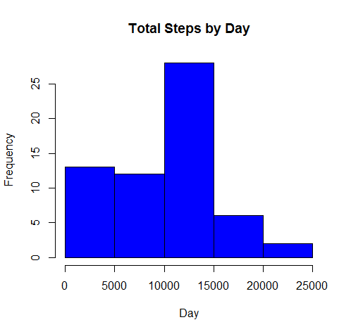
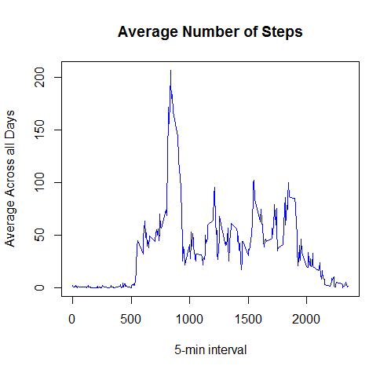
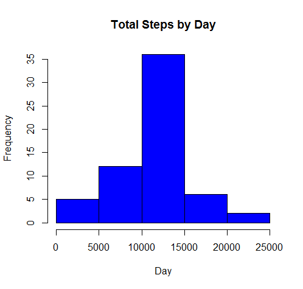
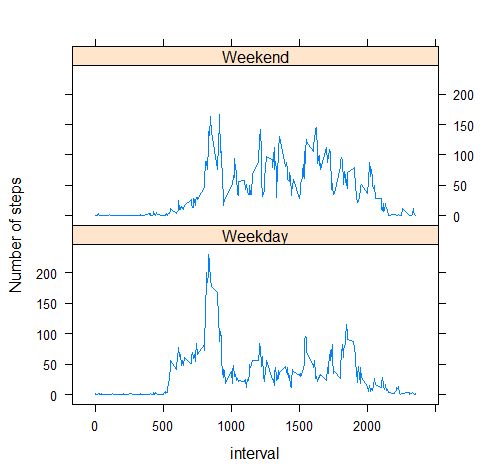

##Loading and preprocessing the data

```r
Activity <- read.csv("activity.csv")
str(Activity)
```

```
## 'data.frame':	17568 obs. of  3 variables:
##  $ steps   : int  NA NA NA NA NA NA NA NA NA NA ...
##  $ date    : Factor w/ 61 levels "2012-10-01","2012-10-02",..: 1 1 1 1 1 1 1 1 1 1 ...
##  $ interval: int  0 5 10 15 20 25 30 35 40 45 ...
```

#####Process/transform the data:

```r
Activity$date <- as.Date(Activity$date, format = "%Y-%m-%d")
```

##What is mean total number of steps taken per day?
#####Total Number of Steps taken per day

```r
steps_day <- tapply(Activity$steps, Activity$date, sum, na.rm=T)
hist(steps_day, breaks = 5, main = "Total Steps by Day", xlab = "Day", col = "blue")
```



```r
summary(steps_day)
```

```
##    Min. 1st Qu.  Median    Mean 3rd Qu.    Max. 
##       0    6778   10400    9354   12810   21190
```
mean    =  9,354
median  = 10,400

##What is the average daily activity pattern?

```r
pattern <- tapply(Activity$steps, Activity$interval, mean, na.rm = TRUE)
plot(row.names(pattern), pattern, type = "l", xlab = "5-min interval", 
     ylab = "Average Across all Days", main = "Average Number of Steps", 
     col = "blue")
```



#####Maximum average number of steps at interval:

```r
pattern[pattern==max(pattern)]
```

```
##      835 
## 206.1698
```

#####Maximum number of steps is at interval 835 where steps = 206.1698

##Imputing missing values
#####Total number of missing values in the dataset 

```r
missing <- Activity[!complete.cases(Activity), ]
nrow(missing)
```

```
## [1] 2304
```

#####Use mean for 5-minute interval to impute missing value

```r
pattern_dt <- data.frame(pattern)
pattern_dt$interval <- row.names(pattern_dt)
colnames(pattern_dt)[1] <- "steps"
Activity_M <- merge(Activity, pattern_dt, by = "interval", all.x=T )
Activity_M$steps <- ifelse(is.na(Activity_M$steps.x), Activity_M$steps.y, Activity_M$steps.x)
```

#####Total number of steps taken each day with impute missing value

```r
steps_missing_day <- tapply(Activity_M$steps, Activity_M$date, sum, na.rm=T)
hist(steps_missing_day, breaks = 5, main = "Total Steps by Day", xlab = "Day", col = "blue")
```



```r
summary(steps_missing_day)
```

```
##    Min. 1st Qu.  Median    Mean 3rd Qu.    Max. 
##      41    9819   10770   10770   12810   21190
```
mean = 10,770
median = 10,770
The distribution does not deviate but the mean and median increase. 

##Are there differences in activity patterns between weekdays and weekends?
#####Create weekend and weekday data

```r
library(Hmisc)
```

```
## Loading required package: lattice
```

```
## Loading required package: survival
```

```
## Loading required package: Formula
```

```
## Loading required package: ggplot2
```

```
## 
## Attaching package: 'Hmisc'
```

```
## The following objects are masked from 'package:base':
## 
##     format.pval, round.POSIXt, trunc.POSIXt, units
```

```r
library(dplyr)
```

```
## 
## Attaching package: 'dplyr'
```

```
## The following objects are masked from 'package:Hmisc':
## 
##     combine, src, summarize
```

```
## The following objects are masked from 'package:stats':
## 
##     filter, lag
```

```
## The following objects are masked from 'package:base':
## 
##     intersect, setdiff, setequal, union
```


```r
Activity_M$Day <- weekdays(Activity_M$date)
Activity_M$Weekday <- as.factor(ifelse(Activity_M$Day == "Saturday" | Activity_M$Day=="Sunday", "Weekend",                           "Weekday"))

newdata<- Activity_M %>% 
    group_by(Weekday,interval) %>%
    summarise(meansteps=mean(steps))

with (newdata, 
      xyplot(meansteps ~ interval|Weekday, type="l", 
             ylab="Number of steps",layout=c(1,2)))
```



